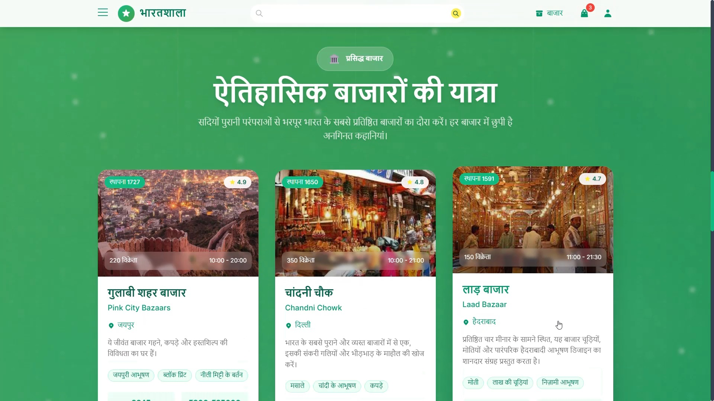
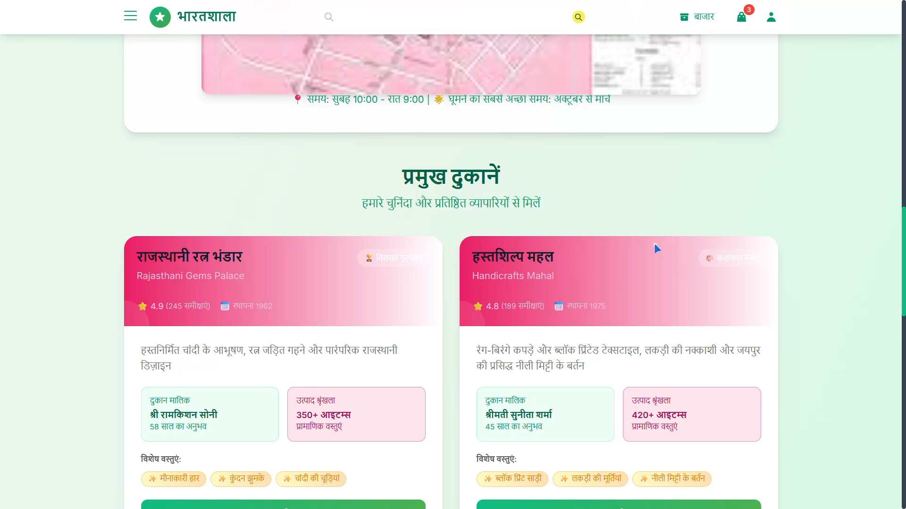
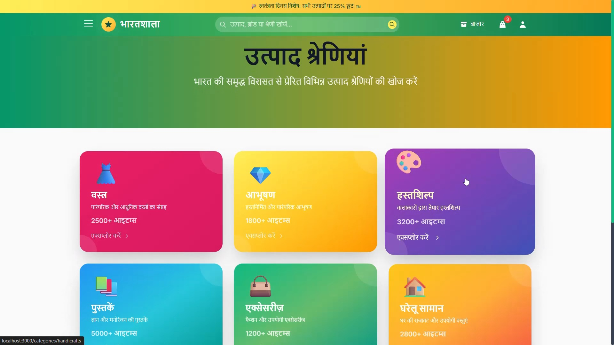

<div align="center"></div>

# <div align="center">BHARATSHAALA</div>

**Bharatshaala** is a culture-first marketplace and discovery platform celebrating India’s vibrant local markets, artisans, and authentic products. It blends a premium, modern shopping UX with a mission: elevate India’s heritage, empower small sellers, and build global awareness about the richness and depth of Indian culture, values, and craftsmanship.

---

## 🇮🇳 Vision and Mission

- Celebrate India’s cultural wealth by bringing historic and modern markets to a digital-first audience.
- Bridge the global awareness gap around Indian craftsmanship, traditions, and regional diversity.
- Empower micro, small, and medium vendors with tools to reach customers across India and beyond.
- Promote social good through fair representation, dignified livelihoods, and transparent commerce.
- Evoke a sense of pride and patriotism by curating authentic stories, products, and markets.

---
## 🚀 Live Demo

Experience Bharatshaala live here: 
👉 [](https://Bharatshaala.vercel.app/)

 <div align="center">
 <p>

[](https://github.com/ellerbrock/open-source-badges/)


 </p>
 </div>

## 📸 Screenshots

<div align="center"></div>
<div align="center"></div>

---

## 🌟 Highlights at a Glance

- Immersive home page with culturally inspired visuals, animated gradients, and parallax.
- Market discovery for iconic bazaars (Chandni Chowk, Pink City, Laad Bazaar, etc.) with rich visuals and data.
- Category-first shopping journey with curated subcategories and featured products.
- Robust cart, couponing, and checkout flows with sync for authenticated users.
- Vendor-ready routing for inventory, orders, analytics, and catalog management (scaffolded).
- Multi-provider architecture: Auth, Cart, Theme, Notifications, Language.
- Accessibility, performance, and SEO considered from the ground up.

---

## 🧭 Why This Matters: Social Good, Pride, and Representation

### Cultural Pride and Patriotism
- Tells India’s story through markets, products, and design—colors, typography, and motion reflect Indian vibrancy.
- Surfaces historic context (established years, specialties, local languages) to foster appreciation.
- Curates authentic, region-specific products and narratives to inspire pride.

### Spotlighting the Underrepresented
- Many local markets are offline or underexposed—Bharatshaala gives them a compelling digital stage.
- Fair visibility for artisan clusters and MSMEs beyond major metros.
- Encourages discovery of crafts and techniques unique to regions.

### Economic Empowerment
- Vendor-focused routes (dashboard, orders, items, inventory, analytics) help sellers operate sustainably.
- Transparent features for coupons and fulfillment to drive consistent income.

### Awareness and Education
- Market pages highlight specialties, nearby attractions, and cultural context.
- Category narratives and product stories help global audiences understand depth and value.

---

## 🖥️ User Experience and Features

### A) Home Page
- Dynamic hero with gradient animations, parallax, and culturally relevant iconography.
- Animated trust stats (vendors, products, markets, ratings) with count-up effects.
- Rich carousel capturing Indian textures and moods.
- Popular Categories grid with interactive hover states and micro-animations.
- Featured Markets with MarketCards: images, ratings, vendors, badges, specialty chips.
- Testimonials with auto-rotation and ratings.
- Newsletter CTA with layered, textured backgrounds.
- “Our Values” highlighting authenticity, fast delivery, and satisfaction guarantees.

Key components: Navbar, Footer, Carousel, CategoryCard, MarketCard, ProductCard, LoadingSpinner.

### B) Markets Discovery
- Markets index with search and filters (state, category), and sorting (popular, rating, reviews, alphabetical, established).
- Grid/list view toggle.
- MarketCard design:
  - Hero image, rating badge, established year chip
  - Vendors, hours, specialties, and quick CTAs
  - Subtle zoom and depth on hover
- Each market wired to a detailed route (e.g., /markets/pinkcity, /markets/chandni-chowk, etc.).

### C) Categories and Products
- Category Landing:
  - Rich hero with banners and iconography
  - Subcategory tiles with imagery and counts
  - Featured products grid with add-to-cart and wishlist
- SEO via react-helmet-async on category pages.
- Framer Motion animations for smooth transitions.

### D) Cart and Checkout
- Cart state persisted (localStorage for guests, API persistence for authenticated users).
- Sync strategy for logged-in users (periodic sync + conflict handling for stock/price).
- Totals calculation with coupons, shipping, taxes, and savings breakdown.
- Cart operations: add, remove, update quantity, clear, apply/remove coupon, validate.

### E) Account, Wishlist, Orders (Routing in place)
- Pages scaffolded for:
  - Account, Wishlist, Track Order
  - User Dashboard, Orders, Settings, Address Book, Payment Methods, Notifications

### F) Vendor Experiences (Routing scaffolded)
- Vendor Dashboard, Orders, Items, Edit/Add Item, Analytics, Inventory.
- Ready for integrating APIs for inventory management, order processing, and business analytics.

### G) Supportive Infrastructure
- ErrorBoundary for graceful failures with user-friendly reload prompts.
- Notifications (success/warning/error) across actions like add-to-cart, coupon apply, and sync conflicts.
- Language and Theme providers to support localization and theming across the app.
- Performance via Suspense fallbacks and progressive, on-scroll animations.

---

## 🛠️ Technology Stack

### Frontend


### Backend (Pluggable APIs)


Utilities and Services:
- LocalStorage persistence and client-side analytics hooks on the frontend
- Vendored Razorpay SDK present under backend/razorpay for reference/tests (we recommend installing the pip package)

---

## ⚙️ Installation and Setup

> The repo contains a React frontend and a Flask backend. Follow these steps to run both locally.

### Prerequisites

Ensure you have the following installed:
- Python 3.9+ and pip
- Node.js 16+ and npm
- Windows, macOS, or Linux

### 1) Clone the repository
```bash
git clone https://github.com/eccentriccoder01/Bharatshaala.git
cd Bharatshaala
```

### 2) Backend setup (Flask + SQLite)

Important: The backend package uses relative imports (e.g., from .config import Config). To avoid the “attempted relative import with no known parent package” error, run Flask by importing the backend as a package.

a) Create a Python virtual environment and activate it
```bash
# Windows (PowerShell)
python -m venv backend\venv
backend\venv\Scripts\activate

# macOS/Linux
python3 -m venv backend/venv
source backend/venv/bin/activate
```

b) Install dependencies
```bash
pip install -r backend/requirements.txt
# Razorpay SDK (required at runtime)
pip install razorpay
```

c) Make backend a package (if not already)
```bash
# Create an empty __init__.py so 'backend' is importable as a package
# Windows
type NUL > backend\__init__.py
# macOS/Linux
touch backend/__init__.py
```

d) Configure environment variables

Create backend/.env (optional) and set secrets. Defaults exist in config.py but you should override in development.

```env
# backend/.env (optional but recommended)
SECRET_KEY=change-me
JWT_SECRET_KEY=change-me-jwt
CORS_ORIGINS=*
# If you want to use SQLAlchemy later:
DATABASE_URL=sqlite:///bharatshaala.db
# Razorpay keys (test keys are fine)
RAZORPAY_KEY_ID=rzp_test_XXXXXXXXXXXXXX
RAZORPAY_KEY_SECRET=YYYYYYYYYYYYYYYYYYYY
```

e) Initialize SQLite (tables)
The database module will create required tables on import in many paths, but you can safely run:
```bash
# From repo root (while venv is active)
python - << "PY"
import backend.database as db
# Create the commonly used tables
try:
    db.create_user_table()
except Exception: pass
try:
    db.create_invitationcodes_table()
except Exception: pass
try:
    db.create_inventory_table()
except Exception: pass
try:
    db.create_orders_table()
except Exception: pass
print("SQLite initialized at backend/sql.db")
PY
```

f) Run the Flask server
Run Flask from the repo root so Python imports backend as a package:
```bash
# Windows (PowerShell)
$env:FLASK_APP="backend.base:api"
$env:FLASK_ENV="development"
python -m flask run

# macOS/Linux
export FLASK_APP="backend.base:api"
export FLASK_ENV="development"
python -m flask run
```

Server will start at http://127.0.0.1:5000

Note: backend/.flaskenv in the repo points to base.py directly. When running as a package, prefer the explicit FLASK_APP=backend.base:api shown above to avoid import issues.

### 3) Frontend setup (React)

Open a second terminal:
```bash
cd frontend
npm install
npm start
```

The frontend dev server runs at http://localhost:3000 and proxies API calls to Flask via the existing proxy in frontend/package.json:
```json
"proxy": "http://127.0.0.1:5000"
```

---

## 🔁 Typical Dev Workflow

1. Start Flask backend (http://127.0.0.1:5000)
2. Start React frontend (http://localhost:3000)
3. Frontend will proxy API calls to the backend automatically
4. Edit React code and see live reload; restart Flask when editing backend code as needed

---

## Issue Creation ✴

Report bugs and issues or propose improvements through our GitHub repository's "Issues" tab.

## Contribution Guidelines 📑

- Firstly Star(⭐) the Repository
- Fork the Repository and create a new branch for any updates/changes/issue you are working on.
- Start Coding and do changes.
- Commit your changes
- Create a Pull Request which will be reviewed and suggestions would be added to improve it.
- Add Screenshots and updated website links to help us understand what changes is all about.

- Check the [CONTRIBUTING.md](CONTRIBUTING.md) for detailed steps...

## Contributing is fun🧡

We welcome all contributions and suggestions!
Whether it's a new feature, design improvement, or a bug fix - your voice matters 💜

Your insights are invaluable to us. Reach out to us team for any inquiries, feedback, or concerns.

## 📄 License

This project is open-source and available under the MIT License.

## 📞 Contact

Developed by [Eccentric Explorer](https://eccentriccoder01.github.io/Me)

Bharatshaala aspires to be more than an online marketplace—it’s a cultural bridge. By giving Indian markets a beautiful, honest digital expression—backed by responsible commerce and modern tech—we can inspire pride at home, curiosity abroad, and prosperity for the communities that keep our heritage alive.

Feel free to reach out with any questions or feedback\!
<br>जय हिंद 🇮🇳